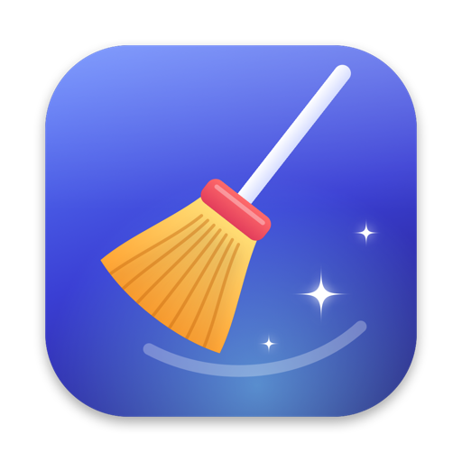

<p align="center">
  
</p>

<h1 align="center">Sweep</h1>

<p align="center">
  Pulizia consapevole per macOS, open source.<br>
  Sweep trova quello che occupa spazio inutilmente sul tuo Mac, ti spiega cos'è<br>
  e ti lascia decidere cosa rimuovere.
</p>

## Cosa fa

- **Pulizia** — cache delle app, log e report di crash, dati temporanei di Xcode,
  cache di npm/pnpm/Bun/Gradle/Cargo, allegati di Mail, installer nei Download,
  archivi di Xcode, backup di iPhone/iPad, Cestino. Ogni categoria spiega cosa
  contiene e cosa succede se la elimini.
- **Disinstalla app** — rimuove un'app insieme a preferenze, cache, container,
  file di supporto, agenti di avvio e stato salvato. Se l'app è aperta ti chiede
  prima di chiuderla.
- **File grandi** — elenca i file oltre una soglia (da 50 MB a 1 GB) in una
  cartella a tua scelta.
- **Panoramica** — spazio usato e libero sul disco.

## Principi

- **Niente a sorpresa.** Ogni elemento è elencato con percorso e dimensione prima
  di essere rimosso, e ogni rimozione chiede conferma.
- **Reversibile per impostazione predefinita.** Tutto va nel Cestino; l'eliminazione
  definitiva è un'opzione nelle Impostazioni.
- **Solo ciò che è sicuro è preselezionato.** Le categorie che possono contenere
  dati che ti servono (installer, archivi, backup, Cestino) sono marcate
  "Da controllare" e vanno selezionate a mano.
- **Percorsi protetti.** `SafetyGuard` rifiuta qualunque percorso fuori dalle zone
  previste (mai `~/Documents`, `~/Library/Keychains`, iCloud, `.ssh`, cartelle di sistema…).
- **Nessuna rete, nessuna telemetria, nessun processo in background.**

## Compilare

Servono macOS 14+ e Xcode 15+ (o la toolchain Swift 5.10+).

```bash
./Scripts/build-app.sh
```

```bash
open build/Sweep.app
```

Per lo sviluppo: `swift run Sweep` e `swift test`.

## Rilasciare una versione

Serve la [GitHub CLI](https://cli.github.com) con l'accesso effettuato (`gh auth login`).

```bash
./Scripts/release.sh 1.2.0
```

Lo script esegue i test, compila l'app universale (Apple silicon + Intel) con
quel numero di versione, la comprime e pubblica la release `v1.2.0` con lo zip
allegato. Con `--draft` la crea come bozza, con `--dry-run` compila e comprime
senza pubblicare nulla. Si rifiuta di partire se ci sono modifiche senza commit
o se il commit non è ancora su GitHub.

## Permessi

macOS chiede da solo, con una finestra, l'accesso a Download, Documenti e
Scrivania la prima volta che Sweep li legge.

Il Cestino, i backup di iPhone/iPad, gli allegati di Mail e i container di altre
app richiedono invece l'**Accesso completo al disco**, un permesso diverso che
macOS non propone mai da solo:

1. Impostazioni di Sistema → Privacy e sicurezza → Accesso completo al disco.
2. Attiva Sweep; se non è in elenco aggiungilo con **+** o trascinandolo dal Finder.
3. Riavvia Sweep.

Quando una categoria non è leggibile, la sezione Pulizia lo segnala e offre i
pulsanti per aprire le Impostazioni, mostrare Sweep nel Finder e riavviare l'app.

Finché l'app è firmata ad-hoc, macOS lega il permesso a quella build esatta:
dopo ogni ricompilazione va tolto e ridato.

## Struttura

| Percorso | Contenuto |
| --- | --- |
| `Sources/SweepCore` | Scansione, calcolo dimensioni, regole di sicurezza, rimozione |
| `Sources/Sweep` | Interfaccia SwiftUI |
| `Tests/SweepCoreTests` | Test della logica |
| `Scripts/build-app.sh` | Compila e assembla `build/Sweep.app` |
| `Scripts/make-icon.swift` | Disegna l'icona dell'app |
| `Resources` | `Info.plist` e icona |

Per cambiare l'icona modifica `Scripts/make-icon.swift`, elimina
`Resources/AppIcon.icns` e rilancia `build-app.sh`.

## Limiti noti

- I file in `/Library` che richiedono privilegi di amministratore non vengono
  rimossi: Sweep li segnala tra gli elementi non rimossi.
- L'app è firmata ad-hoc, non notarizzata.
- Interfaccia solo in italiano.

## Licenza

[MIT](LICENSE)
